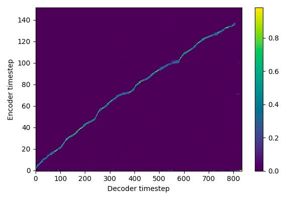

# Tacotron 2 (without wavenet)

PyTorch implementation of [Natural TTS Synthesis By Conditioning
Wavenet On Mel Spectrogram Predictions](https://arxiv.org/pdf/1712.05884.pdf). 

## Pre-requisites
Tested on CUDA 11.3 with CUDNN and pytorch 1.8, python 3.8
In this version of tacotron2 many new tweaks are added.
- Batching strategy to minimize padding
- Guided diagonal attention loss
- New forward attention
- Ability to add pauses in text
- GST vectors and TPSE from BERT for inference
- Traceability for easy deployment including TPSE module


# TLDR
```bash
MODEL_NAME="mike" CONFIG=configs/config_mike.yaml MESSAGE="mike forward" OUT_PATH=/home/frappuccino/tts_checkpoints/mike/v2_forward/ RUN_ID="150622_01f" ./train.sh
```
check script before running! it sets as training from scratch on ljspeech by default! maybe you would need to fine-tune from pre-train
after training, script would make bert vectors & train tpse and also trace model with embedded scale stats


## Training a new voice
1. Get audio - text pairs, good quality, pay special attention to noises and variety of phrases. Clean very short/long/broken phrases
2. Preprocess audio – clean noise, compress in Audacity if needed, normalize amount of silence before/after phrases.
   In preprocessing scripts audio will be normalized to have norm 1.0 and then mel-spectrograms by mean/std once again.
3. Preprocess texts – in order to add pauses use MFA (montreal forced aligner). You can try without this step at first
4. Make mel-spectrograms and compute mean-var stats for normalization and start training
5. At the end you will have traced tacotron2 model ready for inference, check demo.py

logs will be sent to wandb.ai. At the first run it will ask you for your credentials. Register and paste into terminal.
Good results on LJSpeech are expected to come after 6 hours of training on 2 RTX 3090 with fp16 and batch 128 on each gpu (10k iters)


## Setup
1. Download and extract the [LJ Speech dataset](https://keithito.com/LJ-Speech-Dataset/)
2. Clone this repo and cd into this repo: `cd text-to-speech`
3. Create conda env `conda create -n tts python=3.8 && conda activate tts`
4. Install pytorch `conda install pytorch torchvision torchaudio cudatoolkit=11.3 -c pytorch`
5. Install python requirements: `pip install -r requirements.txt`
6. Instal sndfile `sudo apt install libsndfile1`
7. Copy filelists/ folder to your data folder and cd into it
8. Update .wav paths: `sed -i -- 's,DUMMY,ljs_dataset_folder/wavs,g' filelists/ljspeech/*.txt`


## Adding pauses
Additionally and optionally, for adding pauses into training data, you need to get text-to-audio alignments.
It is achieved through montreal-forced-aligner: [example](https://montreal-forced-aligner.readthedocs.io/en/latest/example.html)
1. Follow the instructions [here](https://montreal-forced-aligner.readthedocs.io/en/latest/installation.html#installation)
2. Download only the librispeech lexicon: [link](https://drive.google.com/open?id=1dAvxdsHWbtA1ZIh3Ex9DPn9Nemx9M1-L) and put it somewhere
3. Prepare lab files for alignment: `python scripts/3_prepare_mfa.py filelists/`
4. (optional) extend the pronunciation lexicon using `python scripts/4_extend_dict.py WAVS_DIR librispeech-lexicon.txt NEW_LEXICON`
5. download english speech model for mfa `mfa model download acoustic english_us_arpa`
6. run the alignment `mfa align -j 32 WAVS_DIR LEXICON english_us_arpa ALIGNMENTS_PATH -v --clean`
7. after successful alignment (usually 20-30 min) run `PYTHONPATH=. python scripts/make_pauses_from_alignments.py --input_dir filelists/ --alignments_path ALIGNMENTS_PATH`


## Training Fre-GAN
Fre-GAN is an improvement over HifiGAN achieving same level of quality with 5x less training time.
1. Prepare ljspeech pretrain using provided `config.json` in `fre-gan/` folder and ground-truth mel-spectrograms (4 gpus)
2. run `cd fre-gan`, `python train.py --input_mels_dir LJ_MELS --checkpoint_path CHECKPOINT_PATH --config config.json
3. prepare teacher forced mel spectograms on trained Tacotron2 model
   ```bash
   CUDA_VISIBLE_DEVICES=0,1 python teacher_forcing.py --checkpoint_dir /home/frappuccino/outdir/mike_130622_03f/
   ```
   it will create mels_gen/ folder close to mels/ in dataset folder
4. change paths to new filelists/ in `config.json` and run training with new `--input_mels_dir` provided and `--fine_tuning` flag
Make sure though you specified new checkpoint path but you have put latest generator and discriminator from pre-train
5. trace checkpoint to final model folder to demo with `python trace.py -c CHECKPOINT_PATH --out_path $OUT_PATH/generator.pth`


## Inference and demo
1. Download published [HiFi-GAN](https://github.com/jik876/hifi-gan) model
2. `jupyter notebook --ip=0.0.0.0 --no-browser`
3. Load inference.ipynb, follow details inside for tracing of vocoder
4. Additionally, you can run streamlit demo, see `demo.py`

N.b.  When performing Mel-Spectrogram to Audio synthesis, make sure Tacotron 2
and the Mel vocoder were trained on the same mel-spectrogram representation. 


## FAQ
1. Pre-training is really important if you have less than 2h data! Also more short audio clips better than overall longer audios
2. Good alignment, starts at the bottom left, end at the upper-right (excluding padding), line is bold, without notable plateau bc of pauses, monotonically increasing 

3. You shold catch the moment, when align.error drops, good numbers usually bellow 0.5
4. When training tpse with l1 loss, it should be lower as the average l1 between every vector. 0.07 and less is a good number
5. padding should not be too big in a batch, as it harms gate loss and training speed
6. same applies for trailing or leading silence in audio – it greatly harms alignment training.
7. validation gate loss might go up after training gate loss is still lowering, it is ok
8. You can try setting higher weight_decay, p_attention_dropout until alignment converges
9. Setting n_frames_per_step=2 increases discrepancy between prenet features from previous gt_frame in teacher forcing mode and
also speeds up training in ~2 times as absolute number of frames to predict also decreases. It usually speeds up training and helps
with alignment, but might slightly harm quality of audio. But you can fine-tune with n_frames=1 after alignment converges.
